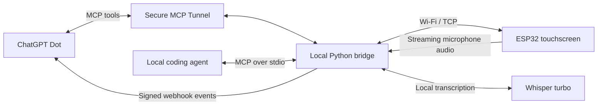

# esp32-dot

A small physical interface for ChatGPT Dot: a touchscreen companion that can show
messages, ask you to choose between options, and send your voice messages to Dot.
It sits on your desk, animates while sleeping, and asks for attention when there
is something to read or answer.

The device runs native Rust firmware with ESP-IDF/FreeRTOS and an LVGL interface
using Inter. A bridge on your computer handles the message queue, local speech
recognition, and MCP connection to Dot. The ESP32 does not run a language model.

Designed by rsms and built in collaboration with ChatGPT.

## What it does

- **Messages:** a yellow attention screen waits for a tap, then shows paginated
  text. Swipe or tap the side regions to navigate; confirm the final checkmark
  to dismiss.
- **Questions:** read the question, browse up to three choices, tap one, then
  confirm it. The selected option goes back to Dot.
- **Voice:** hold the sleeping or idle screen to talk, then release to send.
  Your computer transcribes the recording locally with Whisper turbo. Dot can
  reply in chat and on the display.
- **Sleep:** after 10 seconds of idle time, an animated sleeping character
  appears and brightness drops from 80% to 20%. Interaction restores brightness.
- **Development:** capture the actual rendered pixels over USB, exercise the
  interface with simulated touch, and benchmark redraws and animations.

This is an experimental project. Cloud replies can be delayed, full-screen
updates are not yet synchronized to the panel's refresh, and speaker output is
not implemented. The display currently supports printable ASCII and newlines.

## How it works



The bridge owns the durable queue, transcripts, and replies. The device renders
cards and returns stable option IDs; actions such as sending an email remain
Dot's responsibility. Replies are saved before acknowledgement and deduplicated
on retry. Queued requests survive bridge restarts.

The local MCP connection works without a cloud tunnel. To use the device from
Dot in ChatGPT—including when chatting from another computer or phone—keep the
bridge computer awake, online, and connected to the tunnel.

## What you need

- A **Waveshare ESP32-S3-Touch-AMOLED-1.8**, with a USB data cable. The firmware
  detects its V1/V2 display variants; development has used V2.
- A **Mac**, with Apple Silicon being the tested host for local recognition.
  The service installer uses macOS launchd. Other hosts need additional setup.
- A **2.4 GHz Wi-Fi network** shared by the Mac and device, permitting local
  connections and mDNS (`.local` hostnames).
- Git, Rust/Cargo with a stable toolchain, [uv](https://docs.astral.sh/uv/),
  Node.js/npm, CMake, Ninja, and GNU make (`gmake` on macOS).
- For cloud integration, a ChatGPT workspace with Dot, custom MCP plugins, and
  Secure MCP Tunnel access, plus the corresponding Platform permissions.

The application and protocol can be adapted to other boards. **Sharing Xtensa
and FreeRTOS is not enough to run this firmware unchanged:** display, touch,
audio, power, memory, and pin assignments need board support. See
[hardware and porting](docs/hardware.md).

## Build and flash

Run the following from your checkout. Install the pinned Xtensa Rust toolchain
with [espup](https://github.com/esp-rs/espup); upstream Rust alone cannot build
this target:

```sh
cargo +stable install espup --locked
espup install --name esp-1.97.0.0 --toolchain-version 1.97.0.0 --targets esp32s3
. "$HOME/export-esp.sh"

sh scripts/bootstrap.sh
sh scripts/build.sh --locked
.tools/python/bin/python scripts/device.py info
.tools/python/bin/python scripts/device.py flash
```

Flashing replaces the device's firmware and partition table. The helper selects
the sole connected Espressif USB device; use `--port <SERIAL_PORT>` if several
are connected. It checks the image fits the 4 MiB application partition before
writing. To inspect startup:

```sh
.tools/python/bin/python scripts/device.py monitor --reset --seconds 15
```

`bootstrap.sh` installs repository-local helpers. The first build downloads
ESP-IDF and its managed dependencies. Generated artwork and fonts are checked
in, so Figma is not needed to build. Use `scripts/build.sh` after C or font
changes too: it makes Cargo recheck the additional C components.

Versions are pinned in `rust-toolchain.toml`, `Cargo.lock`, and
`components_esp32s3.lock`: ESP-IDF 5.5.5, Waveshare BSP 2.0.3, LVGL 9.2.2, and
`esp_lvgl_port` 2.6.2. Build products live in ignored `.tools/`, `.embuild/`,
`managed_components/`, and `target/` directories.

## Set up the bridge and Wi-Fi

Install the bridge as a user service, then provision the device over USB:

```sh
.tools/python/bin/python scripts/bridge-service.py install
scutil --get LocalHostName
.tools/python/bin/python scripts/device.py configure --host "<MAC_HOSTNAME>.local"
curl --fail http://127.0.0.1:8788/health
```

Replace `<MAC_HOSTNAME>` with the output of `scutil`. The configuration command
prompts for your Wi-Fi network and a hidden password. It saves those credentials,
the hostname, and a pairing token on the device. Use a hostname instead of a DHCP
address. Wait for `/health` to report `connected: true` and `transport: "tcp"`.

The service starts at login and uses absolute paths, so keep the checkout in
place. Only run one bridge at a time. For foreground development, stop the
service and run the bridge yourself:

```sh
.tools/python/bin/python scripts/bridge-service.py stop
.tools/python/bin/python scripts/bridge.py
```

Use `bridge.py --serial auto` for USB card transport during development. If that
process owns USB, add `--via-bridge` to the provisioning command. Voice streaming
requires Wi-Fi. Run `bridge-service.py install` again to restore the service.

To change the saved host without re-entering Wi-Fi credentials, use USB:

```sh
.tools/python/bin/python scripts/device.py set-host --host "<NEW_HOSTNAME>.local"
```

Try a message before connecting Dot:

```sh
curl --fail http://127.0.0.1:8788/cards \
    -H 'Content-Type: application/json' \
    -d '{"kind":"notice","body":"Hello from esp32-dot."}'
```

Tap the yellow attention screen to read it, then advance to the checkmark and
dismiss it.

## Connect a local coding agent

The bridge exposes MCP through `scripts/mcp-stdio.py`. For Codex, register it and
install the accompanying skill from the repository root:

```sh
mkdir -p "$HOME/.agents/skills"
ln -s "$PWD/skills/rsms-dot" "$HOME/.agents/skills/rsms-dot"
codex mcp add rsms-dot -- "$PWD/.tools/python/bin/python" "$PWD/scripts/mcp-stdio.py"
```

Inspect an existing symlink or MCP registration before replacing it. For another
client, choose **STDIO**, use `<PROJECT_DIR>/.tools/python/bin/python` as the
command and `<PROJECT_DIR>/scripts/mcp-stdio.py` as its argument. The adapter reads
the local credential itself; no environment variables are needed.

`<PROJECT_DIR>` means your checkout's absolute path. Identifiers such as
`rsms-dot`, `pip-firmware`, and `local.rsms.pip-bridge` are existing package and
service names, not a required name for your Dot. The supplied skill and tool
descriptions include the original owner's name; personalize them for your setup.

## Connect ChatGPT Dot

Local MCP registration does not connect cloud Dot. These steps expose the same
bridge through a private tunnel. Use your own names and IDs for all placeholders.

### 1. Start a Secure MCP Tunnel

In [Platform tunnel settings](https://platform.openai.com/settings/organization/tunnels),
create `<TUNNEL_NAME>` and associate it with your ChatGPT workspace. Creation
requires Tunnels Read + Manage; create a runtime API key with Tunnels Read + Use.
See the official [Secure MCP Tunnel guide](https://developers.openai.com/api/docs/guides/secure-mcp-tunnels)
for workspace access requirements.

```sh
.tools/python/bin/python scripts/tunnel.py install-client
.tools/python/bin/python scripts/tunnel.py configure
.tools/python/bin/python scripts/tunnel.py status
.tools/python/bin/python scripts/tunnel.py doctor
```

`configure` prompts for `<TUNNEL_ID>` and the hidden runtime key, then starts the
managed client. Expect `process_running`, `healthy`, and `ready` to be true.
The key stays in a local file with mode 0600. The tunnel targets the stdio MCP
adapter; no router port forwarding is needed.

### 2. Add the plugin

Open [ChatGPT Plugins](https://chatgpt.com/plugins) in a web browser in the
associated workspace:

1. Choose **Add custom MCP server** and name it `<PLUGIN_NAME>`.
2. Choose **Tunnel** under Connection and select your tunnel.
3. Choose **No authentication**. The tunnel supplies access control, and the
   adapter authenticates to the bridge; this project has no additional OAuth login.
4. Create and scan the plugin, then make it available to your Dot.

The desktop **STDIO / Streamable HTTP** form configures a local connection;
use the web tunnel form for this setup. Check discovery includes `send_message`,
`ask_question`, `get_voice_input`, and both `device.reply` and `device.transcript`.

After changing tools, events, or the imported skill, use the plugin settings'
**Manage app → Refresh tools**, then verify discovery. The local skill symlink
alone does not update the cloud plugin's imported skill.

### 3. Test questions and replies

Send this in your Dot's chat, replacing `<PLUGIN_NAME>`:

> Use `<PLUGIN_NAME>`. Subscribe to device.reply for request_id desk-test-001.
> Ask "Can you see this?" on my desk display with Yes and No options, using that
> request ID. When the reply arrives, tell me in this chat which option I chose.

Tap attention, navigate to a choice, select it, and tap Confirm. Verify that Dot
reports the choice in chat. Use a fresh request ID for each new test.
Subscriptions arrange event delivery; a tool call alone does not subscribe Dot
to future replies.

### 4. Enable voice

Install the local recognizer and restart the bridge:

```sh
sh scripts/setup-audio.sh
.tools/python/bin/python scripts/bridge-service.py restart
curl --fail http://127.0.0.1:8788/audio
```

Wait for `ready: true`, `model: "whisper-large-v3-turbo-q8_0"`, and
`preprocessing: "raw"`. Setup builds a pinned whisper.cpp revision and downloads
checksum-verified model weights. It uses Metal on macOS and keeps the model
loaded between recordings.

Then send Dot:

> Use `<PLUGIN_NAME>` and subscribe to device.transcript. Treat incoming
> transcripts as voice messages from me. Reply both in this chat and on my desk
> display, using send_message for a concise device reply or ask_question when
> I need to choose. Subscribe to device.reply for my choices. If a voice event
> has no readable text, retrieve it with get_voice_input using its recording_id
> before asking me to repeat. Use get_device_status to confirm audio is ready
> and the voice subscription is active.

Hold the sleeping or idle screen, wait for recording to start, speak, and release.
Recordings must contain at least one second of audio after microphone startup
and pass the volume gate. Capture stops at 30 seconds. Verify a reply in **both**
chat and on the device.

Audio streams to the computer during capture; recognition starts after release.
The live input is raw PCM into Whisper turbo, with no host denoising or LLM text
correction. Normal audio is held in memory, not saved as WAVs. Transcripts are
saved locally and delivered only when a voice subscription is active.
An incoming card or host state change currently cancels an active recording.

## Customize it with a coding agent

Open this checkout in your coding agent and give it a concrete interaction,
visual reference, or hardware change. It can edit the firmware and bridge, build,
flash, and compare device screenshots. Tell it which board you have and whether
it may replace the connected device's firmware.

For example:

> Read README.md and docs/hardware.md. Change the sleep character to match the
> attached sketch, keeping its current breathing and tumbling timing. You may
> build and flash the connected device. Capture before/after screenshots and
> run the sleep benchmark. Report what was tested and commit the change.

Or:

> Add a new MCP tool for a focus timer. Keep countdown and rendering on the
> device, and return completion through the bridge. Update the skill and tests,
> and document any plugin refresh needed.

Useful starting points:

| Change | Files |
| --- | --- |
| Screens, gestures, pagination | `components/pip_board/pip_ui.c` |
| Procedural sleep animation | `components/pip_board/pip_sleep.c` |
| Brightness, rotation, display startup | `components/pip_board/pip_board.c` |
| Device microphone and Wi-Fi | `components/pip_board/pip_audio.c`, `pip_network.c` |
| Device commands and card lifecycle | `src/main.rs`, `src/network.rs`, `src/audio.rs` |
| Host queue, MCP tools and events | `scripts/bridge.py`, `scripts/pip_mcp.py` |
| Recognition and tuning | `scripts/pip_audio.py`, `scripts/pip_whisper.py`, `scripts/pip_tuning.py` |
| Dot's use of the device | `skills/rsms-dot/SKILL.md` |
| Artwork and typography | `assets/figma/`, `assets/fonts/`, `scripts/design-assets.py`, `scripts/font.sh` |

The UI uses a 448 × 368 landscape canvas. Source artwork and font generators are
included; generated C assets are checked in. Edit the source/generator rather
than generated arrays, then regenerate the affected assets:

```sh
.tools/python/bin/python scripts/design-assets.py
sh scripts/font.sh
.tools/python/bin/python scripts/tuning-fonts.py
```

MCP messages are limited to 600 printable ASCII characters plus newlines, with
one to three choices of up to 64 characters each. Broader text support requires
both font coverage and protocol validation changes. Preserve stable request IDs
and reply deduplication when changing interactions.

For a development loop:

```sh
.tools/python/bin/python -m unittest discover -s scripts -p 'test_*.py'
cargo fmt --check
sh scripts/build.sh --locked
.tools/python/bin/python scripts/device.py flash
.tools/python/bin/python scripts/device.py screenshot --output .tools/screen.png
```

Screenshots contain the pixels submitted to the display, before physical
scanout. Use them for layout and pixel comparisons; inspect the physical panel
or a camera for tearing, timing, and power issues. If using a shared computer,
ask the agent to capture camera windows without activating them.

Hardware checks require USB, a TCP connection, and an empty message queue:

```sh
.tools/python/bin/python scripts/attention-smoke.py
.tools/python/bin/python scripts/choices-smoke.py
.tools/python/bin/python scripts/render-bench.py --output .tools/render-bench
.tools/python/bin/python scripts/sleep-bench.py
```

Some hardware tests submit choices or capture real microphone audio. Run them
with test subscriptions, or pause live subscriptions that would forward their
output. Host unit tests use isolated fixtures. After bridge changes, restart
its service; after firmware changes, rebuild and flash; after MCP/skill changes,
refresh the cloud plugin as well.

## Record samples for voice tuning

```sh
.tools/python/bin/python scripts/voice-tune.py
```

The device shows phrases to read. **Tap to record, tap to stop**, then choose
Retry, Submit, or Exit. Retry returns to the phrase; Submit saves the take and
advances. Ctrl-C stops the session. Use `start --phrases <PHRASES_FILE>` for a
custom set of 8–100 phrases.

WAVs and reference/transcript metadata are saved in
`.tools/voice-tuning/session-*/`. Tuning samples stay local and do not produce
voice-message events. This mode collects evaluation data; it does not train the
model or change the live raw-audio path. `scripts/audio-benchmark.py` compares
recognizers, while `audio-compare.py` and `audio-enhance.py` create offline filter
comparisons. Their command-line help describes the inputs.

## Operation and troubleshooting

```sh
.tools/python/bin/python scripts/bridge-service.py status
.tools/python/bin/python scripts/bridge-service.py restart
.tools/python/bin/python scripts/tunnel.py start
.tools/python/bin/python scripts/tunnel.py status
curl --fail http://127.0.0.1:8788/health
curl --fail http://127.0.0.1:8788/audio
```

Bridge logs are `.tools/bridge.log` and `.tools/bridge-error.log`. Keep the bridge
and tunnel running; use `tunnel.py start` to reconnect a saved configuration.

| Symptom | Check |
| --- | --- |
| Device not connected | USB data cable, 2.4 GHz Wi-Fi, hostname resolution, LAN access, and `/health`. If the host moved, use `device.py set-host`. |
| Flash cannot find the board | Hold BOOT while resetting/powering on, release BOOT, then retry. Close other serial clients. |
| Blank panel but valid screenshot | Panel startup or power; see [hardware notes](docs/hardware.md). A screenshot does not prove physical scanout. |
| Screenshot cannot open USB | Stop the serial client, or use `/screenshot.png` on port 8788 if the bridge owns USB. |
| Voice unavailable | Run `setup-audio.sh`, restart the bridge, and inspect `/audio` and the error log. |
| Dot sees only `device.reply` | Refresh plugin tools and verify `device.transcript` is discovered before subscribing. |
| Transcript exists but no reply | Check active subscriptions and webhook status with `get_device_status`. Retrieve text with `get_voice_input(recording_id)`. |
| Dot says the transcript is missing | Text is in the event's `data.text`; ask it to use `get_voice_input` before recording again. |

Subscriptions expire and need renewal. Webhook success means receipt, not that
Dot has finished responding; cloud continuation can be slower than local
recognition. Recover an existing request or transcript instead of replaying an
accepted webhook. See [MCP Events](https://developers.openai.com/plugins/build/mcp-events)
for the delivery model.

## Network and stored data

| Default address | Purpose |
| --- | --- |
| LAN TCP 8787 | Authenticated device cards and replies |
| LAN TCP 8790 | Authenticated microphone stream |
| `127.0.0.1:8788` | Local administration and diagnostics |
| `127.0.0.1:8789/mcp` | Bearer-authenticated MCP, used by the stdio adapter |

Device TCP uses a pairing token but no TLS; use a trusted LAN. Keep the
administrative API local. ChatGPT credentials are not stored on the device.

Ignored `.tools/` contains pairing and MCP tokens, tunnel credentials, message
history, transcripts, webhook signing keys, and any tuning recordings. Keep it
out of Git and shared archives. Device Wi-Fi credentials live in NVS. Transcripts
and tuning files remain until deleted. Retrieving a tuning recording through the
cloud MCP audio tool transfers that selected sample to the caller.
